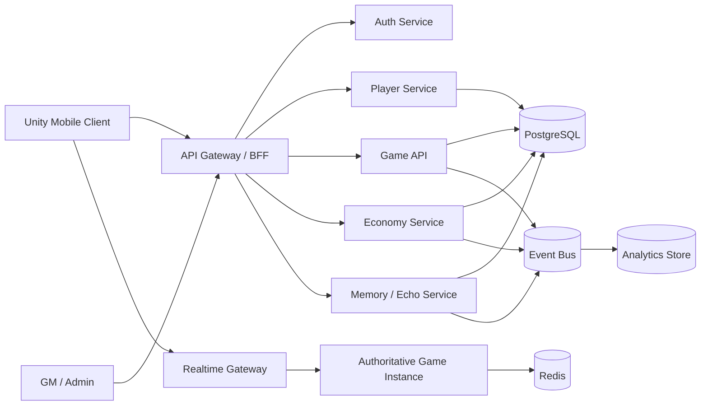

# ECHO — Game Product & Technical Documentation Pack

## 0. Product concept
**ECHO** is a mobile 3D online RPG/simulation hybrid in which the server remembers meaningful player behavior and gradually evolves the world from that history.

The player explores, gathers, fights, trades and socializes. Their actions generate durable **Memory Events**. The **Echo Engine** aggregates those events and periodically converts patterns into world changes such as NPC stories, quests, events, enemy variants, resource shortages and discoveries.

Core fantasy:
> “The world remembers what players did before you, and your actions become part of what the world becomes next.”

## 1. Document map

| Doc | Purpose |
|---|---|
| [01_PRD.md](./01_PRD.md) | Product requirements, personas, scope, KPIs, epics, acceptance criteria |
| [02_ARCHITECTURE.md](./02_ARCHITECTURE.md) | Overall technical architecture, deployment, data flow, non-functional requirements |
| [03_DATABASE.md](./03_DATABASE.md) | PostgreSQL schema, Redis, event store, indexes and data ownership |
| [04_API_SPEC.md](./04_API_SPEC.md) | API contract, auth, endpoint catalog, examples, WebSocket events |
| [05_GAME_WORKFLOW.md](./05_GAME_WORKFLOW.md) | End-to-end game loops and workflows by phase |
| [06_MOBILE_3D_DESIGN.md](./06_MOBILE_3D_DESIGN.md) | Mobile 3D UX, camera, controls, world, rendering and performance budget |
| [07_ECONOMY_MONETIZATION.md](./07_ECONOMY_MONETIZATION.md) | Economy sinks/sources, marketplace, premium model and safeguards |
| [08_SECURITY_OPERATIONS.md](./08_SECURITY_OPERATIONS.md) | Anti-cheat, authoritative server, fraud controls, observability, ops |
| [09_MVP_ROADMAP.md](./09_MVP_ROADMAP.md) | MVP milestones, backlog, team split, release gates |

## 2. Recommended MVP architecture at a glance

## 3. Product principles

1. **Server authoritative**: client suggests actions; server validates and decides outcomes.
2. **Memory creates content, not raw chaos**: Echo Engine uses bounded rules, thresholds and moderation rather than blindly generating content.
3. **Player agency**: players can influence the world through normal gameplay, not only payment.
4. **Pay for expression/convenience, not irreversible dominance** in the initial design.
5. **Mobile-first**: sessions of 5–15 minutes, readable UI, low battery/network cost.
6. **MVP before microservices explosion**: deploy services separately only where scaling or ownership requires it.
