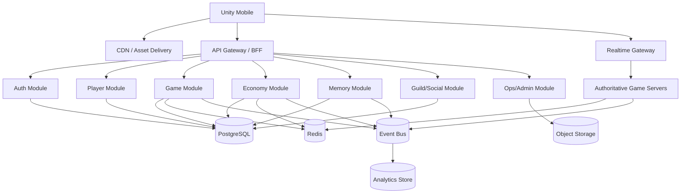
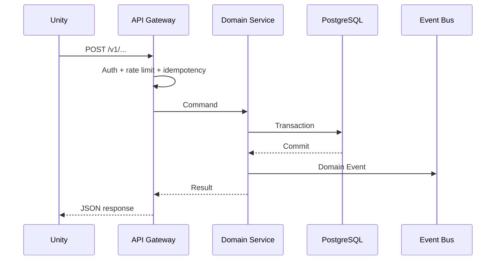
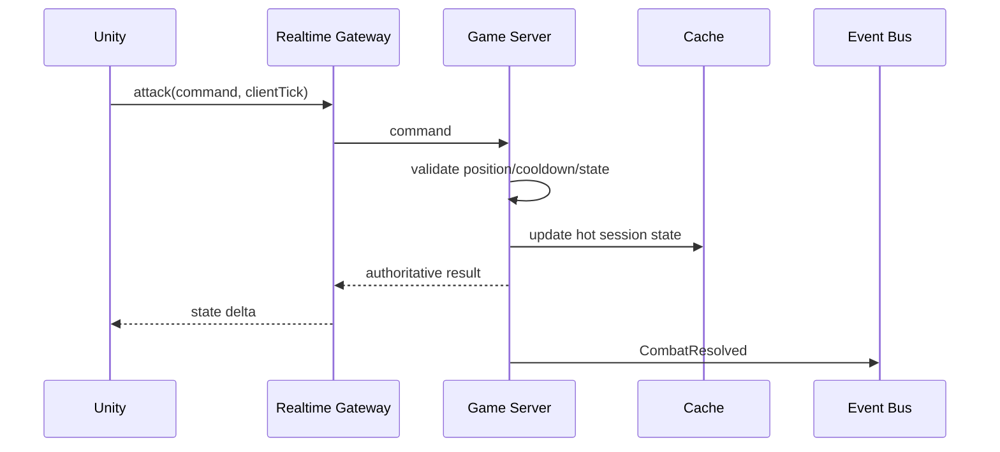

# ECHO — System Architecture

## 1. Architecture goals

- Server authoritative gameplay
- Horizontal scaling for API and realtime sessions
- Strong consistency for inventory/currency transactions
- Event-driven world evolution
- Mobile-friendly network protocol
- Operational simplicity for MVP

## 2. Technology recommendation

| Layer | Technology | Responsibility |
|---|---|---|
| Mobile client | Unity + C# | 3D rendering, input, local presentation |
| API/BFF | Go or Java | authenticated HTTP APIs, orchestration |
| Realtime | WebSocket gateway + game instance servers | movement/combat/event delivery |
| Game simulation | Go | authoritative session simulation |
| Primary DB | PostgreSQL | accounts, characters, inventory, economy, marketplace |
| Cache | Redis | sessions, presence, hot state, rate limits |
| Event bus | Kafka-compatible bus | durable domain/integration events |
| Analytics | ClickHouse/BigQuery-class store | BI, telemetry, economy analytics |
| Object storage | S3-compatible | replays, large assets, audit exports |
| Observability | OpenTelemetry + metrics/logging backend | traces, metrics, logs |
| CI/CD | GitHub Actions/GitLab CI | build, test, deploy |
| Container runtime | Kubernetes or managed container platform | service scheduling |

**MVP simplification:** API, Economy, Player and Memory can start as one modular backend application. Split services when scale or ownership requires it.

## 3. Logical architecture



## 4. Data ownership

| Domain | Owner |
|---|---|
| Account | Auth |
| Character/profile | Player |
| Inventory/equipment | Player + Economy transaction boundary |
| Currency ledger | Economy |
| Marketplace | Economy |
| World configuration | Game |
| Personal memory | Memory |
| World memory / Echo rules | Memory |
| Guild | Social |
| Telemetry | Analytics |

## 5. Request flow — normal REST action



## 6. Request flow — realtime combat



## 7. Echo Engine architecture

Echo Engine is a rules pipeline:

```text
Domain Events
   ↓
Aggregation Window
   ↓
Feature Metrics
   ↓
Rule Evaluation
   ↓
Candidate World Change
   ↓
Safety/Eligibility Checks
   ↓
Publish World Change
   ↓
Game Server consumes change
   ↓
Client receives event
```

### Rule object

```json
{
  "ruleCode": "ZONE_DEATH_FOG_01",
  "eventType": "COMBAT_DEATH",
  "windowMinutes": 1440,
  "threshold": 500,
  "scope": "ZONE",
  "action": "ACTIVATE_WORLD_EVENT",
  "cooldownMinutes": 10080,
  "durationMinutes": 180
}
```

## 8. Deployment topology

### MVP
- 1 API deployment
- 1 realtime gateway deployment
- 2+ game instance replicas
- 1 PostgreSQL primary + managed backups
- Redis
- Event bus
- object storage

### Scale-out
- partition game instances by region/zone
- autoscale API on CPU/RPS
- autoscale game servers on active sessions
- separate read replicas for reporting
- archive old analytics events

## 9. Non-functional requirements

| Area | Target for MVP |
|---|---|
| API availability | ≥99.9% monthly target |
| API p95 | <300 ms for non-heavy commands under expected load |
| Realtime tick | configurable; start around 10–20 Hz depending device/network |
| Durable economy writes | 100% transactional |
| Duplicate command protection | idempotency key where money/item state changes |
| Crash recovery | reconnect and resync authoritative state |
| Data backup | automated managed backups |
| Observability | request IDs + player/session IDs + trace IDs |

## 10. Architecture decisions

### ADR-001 — Server authoritative
Client never decides currency, loot, damage, inventory ownership or marketplace settlement.

### ADR-002 — PostgreSQL as transactional source of truth
Use relational transactions for currency/item ownership. Do not use Redis as the permanent source of truth.

### ADR-003 — Event-driven Echo
Memory/world evolution consumes immutable-ish domain events rather than scanning core tables on every request.

### ADR-004 — Light CQRS
Separate write commands from read models where needed. Do not introduce full event sourcing for every domain in MVP.
