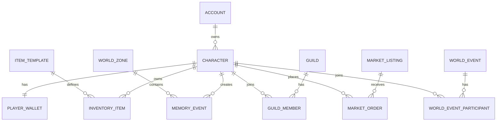

# ECHO — Database Design

## 1. Storage strategy

### PostgreSQL
Authoritative transactional data.

### Redis
Ephemeral/hot data:
- session presence;
- current game instance mapping;
- rate limit counters;
- short-lived locks;
- frequently accessed configuration cache.

### Event bus / event store
Domain events used for Echo aggregation and analytics pipelines.

### Analytics store
High-volume telemetry and BI queries.

## 2. ER model



## 3. Core tables

### account
```sql
id UUID PK
external_auth_id VARCHAR UNIQUE
status VARCHAR
created_at TIMESTAMPTZ
updated_at TIMESTAMPTZ
last_login_at TIMESTAMPTZ
```

### character
```sql
id UUID PK
account_id UUID FK account(id)
name VARCHAR UNIQUE
level INT
xp BIGINT
zone_id UUID NULL
created_at TIMESTAMPTZ
updated_at TIMESTAMPTZ
```

### player_wallet
```sql
character_id UUID PK FK character(id)
gold BIGINT NOT NULL
premium_coin BIGINT NOT NULL
version BIGINT NOT NULL
updated_at TIMESTAMPTZ
```

For production economy, also maintain a ledger.

### wallet_ledger
```sql
id UUID PK
character_id UUID FK character(id)
currency_type VARCHAR
amount BIGINT
balance_after BIGINT
reason_code VARCHAR
reference_type VARCHAR
reference_id UUID
idempotency_key VARCHAR UNIQUE
created_at TIMESTAMPTZ
```

### item_template
```sql
id UUID PK
code VARCHAR UNIQUE
name VARCHAR
rarity VARCHAR
item_type VARCHAR
bind_type VARCHAR
max_stack INT
metadata JSONB
```

### inventory_item
```sql
id UUID PK
character_id UUID FK character(id)
item_template_id UUID FK item_template(id)
quantity INT
upgrade_level INT
rolled_stats JSONB
status VARCHAR
version BIGINT
created_at TIMESTAMPTZ
updated_at TIMESTAMPTZ
```

### memory_event
```sql
id UUID PK
character_id UUID NULL FK character(id)
world_id UUID
zone_id UUID NULL
memory_type VARCHAR
source_event_id UUID
payload JSONB
importance SMALLINT
visibility VARCHAR
created_at TIMESTAMPTZ
```

### echo_rule
```sql
id UUID PK
rule_code VARCHAR UNIQUE
status VARCHAR
window_minutes INT
condition JSONB
action JSONB
cooldown_minutes INT
created_at TIMESTAMPTZ
updated_at TIMESTAMPTZ
```

### world_change
```sql
id UUID PK
world_id UUID
rule_id UUID FK echo_rule(id)
change_type VARCHAR
payload JSONB
status VARCHAR
starts_at TIMESTAMPTZ
ends_at TIMESTAMPTZ NULL
trigger_metric JSONB
audit JSONB
created_at TIMESTAMPTZ
```

### market_listing
```sql
id UUID PK
seller_character_id UUID FK character(id)
inventory_item_id UUID FK inventory_item(id)
quantity INT
unit_price BIGINT
currency_type VARCHAR
status VARCHAR
expires_at TIMESTAMPTZ
created_at TIMESTAMPTZ
```

### market_order
```sql
id UUID PK
listing_id UUID FK market_listing(id)
buyer_character_id UUID FK character(id)
quantity INT
gross_amount BIGINT
fee_amount BIGINT
net_amount BIGINT
status VARCHAR
created_at TIMESTAMPTZ
```

### world_event
```sql
id UUID PK
world_id UUID
code VARCHAR
name VARCHAR
status VARCHAR
config JSONB
starts_at TIMESTAMPTZ
ends_at TIMESTAMPTZ
created_by VARCHAR
```

## 4. Important indexes

```sql
CREATE INDEX idx_character_account ON character(account_id);
CREATE INDEX idx_inventory_character ON inventory_item(character_id);
CREATE INDEX idx_memory_world_created ON memory_event(world_id, created_at DESC);
CREATE INDEX idx_memory_character_created ON memory_event(character_id, created_at DESC);
CREATE INDEX idx_market_status_expiry ON market_listing(status, expires_at);
CREATE INDEX idx_market_template ON market_listing(item_template_id, status, unit_price);
CREATE UNIQUE INDEX uq_wallet_ledger_idempotency ON wallet_ledger(idempotency_key);
```

## 5. Transaction rules

### Buy item
Single database transaction:
1. Lock/validate listing.
2. Lock buyer wallet row.
3. Verify balance.
4. Lock/validate inventory ownership.
5. Move item ownership/quantity.
6. Create debit ledger.
7. Create seller credit ledger.
8. Mark listing/order status.
9. Commit.
10. Publish `MarketplaceOrderCompleted` after commit.

### Upgrade item
Single transaction for:
- item version check;
- material deduction;
- currency deduction;
- upgrade state update;
- ledger entries.

## 6. Memory retention

Recommended MVP policy:
- Keep all high-importance personal memories.
- Keep lower-value raw memories for a rolling period.
- Aggregate older raw events into daily/weekly metrics.
- Keep world-level memories long term.

## 7. Sharding / partitioning path

Do not shard MVP.

When needed:
- partition event-heavy tables by month/world;
- route world/game data by `world_id`;
- isolate analytics storage from transactional DB.
