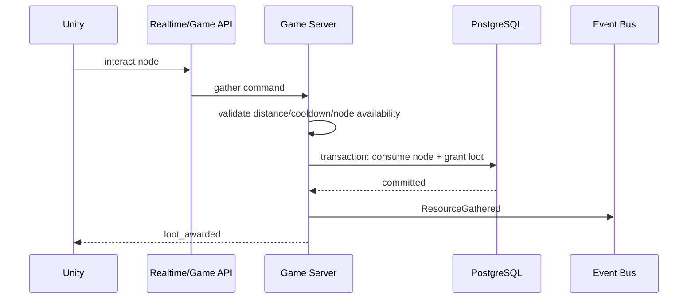
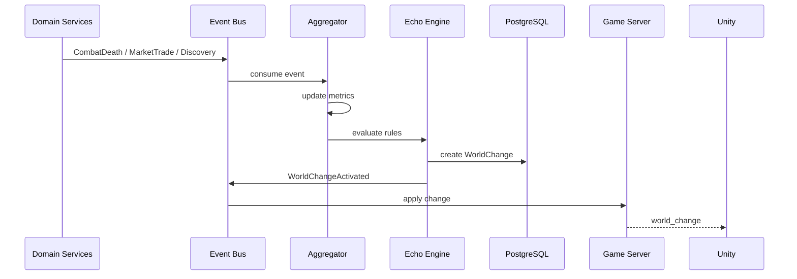

# ECHO — API Specification

## 1. API conventions

Base path: `/v1`

Auth: Bearer access token.

Headers for state-changing requests:
- `Authorization: Bearer <token>`
- `X-Request-Id: <uuid>`
- `Idempotency-Key: <uuid>` when applicable

Content-Type: `application/json`

## 2. Standard response

### Success
```json
{
  "requestId": "7e5d...",
  "data": {}
}
```

### Error
```json
{
  "requestId": "7e5d...",
  "error": {
    "code": "INSUFFICIENT_GOLD",
    "message": "Not enough gold",
    "details": {}
  }
}
```

## 3. Auth APIs

| Method | Endpoint | Purpose |
|---|---|---|
| POST | `/auth/guest` | Guest account bootstrap |
| POST | `/auth/refresh` | Refresh token |
| POST | `/auth/link` | Link social/store identity |

## 4. Player APIs

| Method | Endpoint | Purpose |
|---|---|---|
| GET | `/me` | Account summary |
| GET | `/characters` | List characters |
| POST | `/characters` | Create character |
| GET | `/characters/{id}` | Character detail |
| PATCH | `/characters/{id}` | Rename/cosmetic-safe profile updates |
| GET | `/characters/{id}/inventory` | Inventory |
| GET | `/characters/{id}/equipment` | Equipped items |
| POST | `/characters/{id}/equip` | Equip item |
| POST | `/characters/{id}/unequip` | Unequip item |

## 5. Game APIs

| Method | Endpoint | Purpose |
|---|---|---|
| GET | `/world` | World bootstrap |
| GET | `/zones` | Available zones |
| GET | `/zones/{id}` | Zone detail |
| POST | `/sessions/join` | Request game session |
| POST | `/sessions/leave` | Leave session |
| POST | `/quests/{id}/accept` | Accept quest |
| POST | `/quests/{id}/claim` | Claim completed reward |
| POST | `/gather` | Gather resource node |
| POST | `/craft` | Craft recipe |
| POST | `/dungeons/{id}/enter` | Enter dungeon |
| POST | `/world-events/{id}/join` | Join world event |

## 6. Memory APIs

| Method | Endpoint | Purpose |
|---|---|---|
| GET | `/characters/{id}/memories` | Personal timeline |
| GET | `/worlds/{id}/memories` | Public world memories |
| GET | `/worlds/{id}/changes` | Active/history of world changes |
| GET | `/discoveries` | Discovery catalog |

## 7. Economy APIs

| Method | Endpoint | Purpose |
|---|---|---|
| GET | `/wallet` | Current balances |
| GET | `/wallet/ledger` | Ledger history |
| GET | `/market/listings` | Search marketplace |
| POST | `/market/listings` | Create listing |
| DELETE | `/market/listings/{id}` | Cancel listing |
| POST | `/market/orders` | Buy item |
| GET | `/market/orders/{id}` | Order detail |

### Create listing
```http
POST /v1/market/listings
Authorization: Bearer <token>
Idempotency-Key: 6df...
```
```json
{
  "inventoryItemId": "item-uuid",
  "quantity": 2,
  "unitPrice": 1500,
  "currencyType": "GOLD"
}
```

### Buy listing
```http
POST /v1/market/orders
```
```json
{
  "listingId": "listing-uuid",
  "quantity": 2
}
```

## 8. Guild APIs

| Method | Endpoint | Purpose |
|---|---|---|
| POST | `/guilds` | Create guild |
| GET | `/guilds/{id}` | Guild detail |
| POST | `/guilds/{id}/join` | Join |
| POST | `/guilds/{id}/leave` | Leave |
| POST | `/guilds/{id}/contribute` | Contribute resources |
| GET | `/guilds/{id}/discoveries` | Guild discoveries |

## 9. Shop APIs

| Method | Endpoint | Purpose |
|---|---|---|
| GET | `/shop/catalog` | Premium catalog |
| POST | `/shop/purchase` | Purchase non-random entitlement |
| GET | `/entitlements` | Owned premium entitlements |

## 10. WebSocket

Endpoint: `/ws/game`

### Client → Server commands

```json
{"type":"move","seq":103,"x":10.1,"z":3.2}
{"type":"attack","seq":104,"skillId":"slash_01","targetId":"mob-12"}
{"type":"interact","seq":105,"objectId":"node-77"}
```

### Server → Client events

```json
{"type":"state_delta","tick":8842,"entities":[...]}
{"type":"combat_result","tick":8843,"events":[...]}
{"type":"loot_awarded","items":[...]}
{"type":"world_change","changeCode":"WHISPERING_FOG"}
{"type":"resync_required","reason":"server_restarted"}
```

## 11. API error codes

| Code | Meaning |
|---|---|
| AUTH_REQUIRED | invalid/expired token |
| FORBIDDEN | authenticated but not allowed |
| VALIDATION_ERROR | bad request |
| VERSION_CONFLICT | stale client/item version |
| INSUFFICIENT_GOLD | not enough gold |
| ITEM_NOT_OWNED | ownership check failed |
| LISTING_UNAVAILABLE | listing already sold/expired |
| COOLDOWN_ACTIVE | action not ready |
| RATE_LIMITED | request throttled |
| WORLD_CHANGE_INVALID | world state no longer valid |

## 12. Workflow: gather resource



## 13. Workflow: Echo world reaction



## 14. Idempotency rules

Use idempotency for:
- purchases;
- marketplace order creation;
- reward claims;
- premium grants;
- any request mutating currency/item ownership.

The same `Idempotency-Key` must return the original result for the same authenticated actor.
