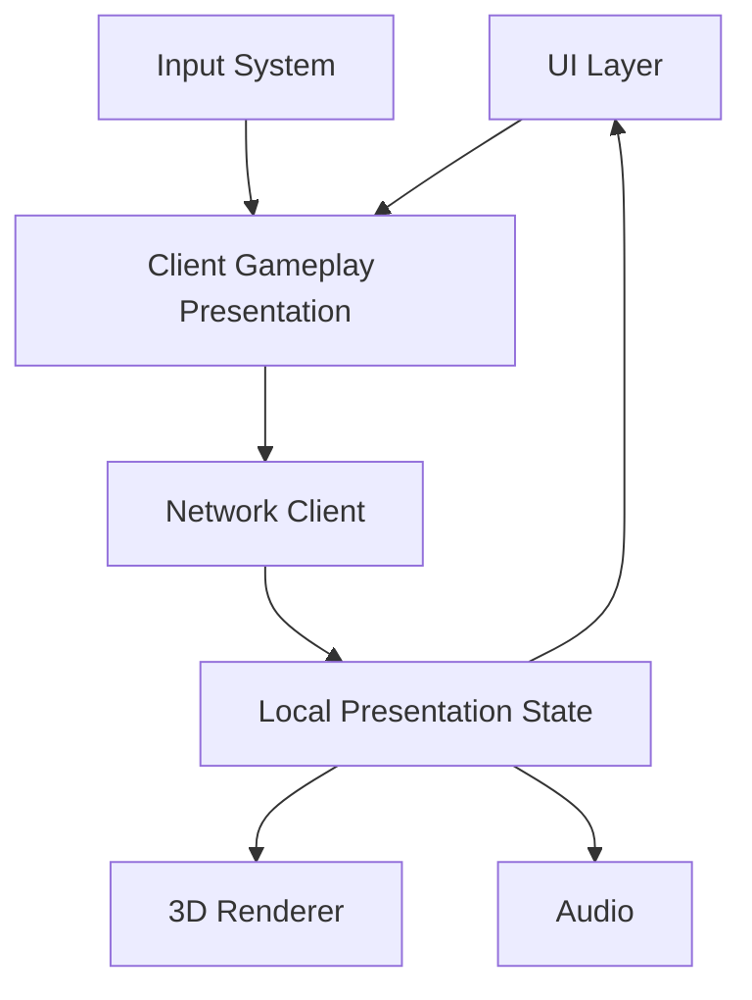

# ECHO — Mobile 3D Game Design

## 1. Visual direction

### Target style
Stylized 3D fantasy/sci-fi with a clean, readable silhouette rather than photorealism.

Why:
- lower device cost;
- recognizable characters;
- easier content production;
- strong cosmetic opportunities;
- readable combat on small screens.

## 2. Camera

Primary camera:
- 3/4 isometric perspective;
- slight follow lag;
- dynamic zoom within bounded range;
- combat focus on current target;
- no forced camera shake except short, optional effects.

Approximate starting values:
- pitch: 45–55°;
- distance: 8–14 units depending area;
- FOV: tune per device and composition.

## 3. Controls

### Left thumb
Virtual joystick for movement.

### Right thumb
Contextual action cluster:
- basic attack;
- 3–4 skills;
- dodge;
- interact.

### Contextual interaction
When near a resource/NPC:
- one large interaction affordance;
- hide irrelevant actions.

## 4. Core HUD

```text
┌────────────────────────────────────┐
│ HP        LV │ Quest / Echo Alert  │
│ XP BAR                            │
│                                    │
│        3D WORLD / CHARACTER        │
│                                    │
│   Joystick                 Skills  │
│   ◉                     ○ ○ ○ ○    │
│                         Attack      │
│                         ◎           │
└────────────────────────────────────┘
```

## 5. Main menu architecture

Bottom navigation:
- **World**
- **Character**
- **Memory**
- **Market**
- **Guild**

Top-level actions should remain within one or two taps from the hub.

## 6. Memory UI

Memory should feel like a living scrapbook.

Card anatomy:
```text
[ICON] First Discovery
Cave of Echoes
18 Sep • Zone 02
“First player in your account to...”
[View location]
```

World memory feed:
- recent;
- rare;
- community milestones;
- active Echoes.

## 7. Echo event presentation

The player should recognize a world reaction in three layers.

### Layer 1 — Subtle
Environmental change.

### Layer 2 — UI signal
Map icon / banner.

### Layer 3 — Narrative
NPC dialog / lore card.

Avoid overwhelming the player with giant notifications for every event.

## 8. 3D world structure

### Hub city
- low-combat area;
- market;
- crafting;
- guild;
- quest board;
- memory archive.

### PvE zone
Each zone contains:
- 1 visual theme;
- 2–3 enemy families;
- gathering nodes;
- 3–5 POIs;
- 1 hidden discovery;
- 1 Echo event slot.

### Dungeon
- instanced;
- 5–10 minute target;
- 3 encounter rooms;
- 1 boss;
- loot table.

## 9. World reaction visual language

Every world change has:
- palette modifier;
- ambient VFX;
- weather/fog preset;
- prop set;
- enemy variant;
- UI badge.

Examples:

**Whispering Fog**
- volumetric-looking fog approximation where affordable;
- desaturated environment;
- distant audio cue;
- spectral enemies.

**Merchant Caravan**
- wagon NPCs;
- temporary market stall props;
- route marker;
- trade bonus UI.

## 10. Mobile performance budget

Target baseline: mid-tier mobile device.

Starting budgets:
- target 30 FPS baseline;
- 60 FPS mode on capable devices;
- keep main scene draw calls conservative;
- aggressively use LOD;
- bake static lighting where possible;
- limit real-time shadows;
- pool combat VFX;
- cap visible AI actors in crowded zones;
- stream assets by area.

These are starting budgets and should be validated on the actual device matrix.

## 11. Rendering approach

Recommended:
- Unity URP;
- baked lighting for static areas;
- light probes for characters;
- LOD groups;
- occlusion culling for dense hubs;
- GPU instancing for repeated props;
- Addressables/content bundles for staged download.

Avoid for MVP:
- excessive transparent materials;
- high-poly unique assets for common props;
- heavy post-processing;
- large always-loaded maps.

## 12. Asset hierarchy

```text
Assets/
  Addressables/
    Characters/
    Enemies/
    Environment/
    VFX/
    Audio/
    UI/
  Scenes/
    Bootstrap
    Hub
    Zone_01
    Zone_02
    Zone_03
  ScriptableObjects/
    Items
    Skills
    Quests
    EchoRules
```

## 13. Unity runtime architecture



The client can predict visual movement for responsiveness, but authoritative outcomes come from the server.

## 14. UX principles

- One primary action per context.
- Avoid tiny tap targets.
- Critical actions need confirmation only when destructive.
- Combat UI must not overlap enemy telegraphs.
- Network failure must be visible but non-disruptive.
- Loading screens communicate what is being downloaded.

## 15. Accessibility

MVP support:
- adjustable UI scale;
- vibration toggle;
- color-independent rarity indicators;
- subtitle option;
- low-VFX mode;
- 30 FPS battery-saver mode.

## 16. Sample screen flow

```text
Login
 ↓
Character Select
 ↓
Hub
 ├→ World Map → Zone → Dungeon
 ├→ Character → Gear
 ├→ Memory → Personal / World
 ├→ Market
 └→ Guild
```
