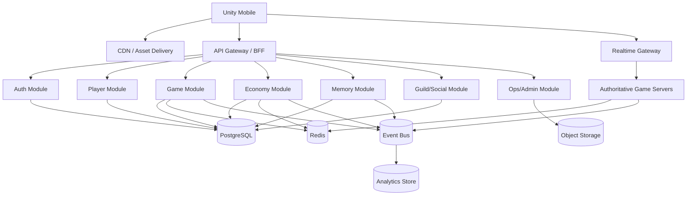
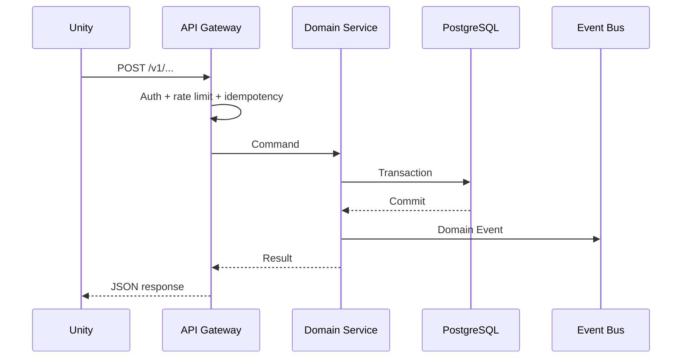
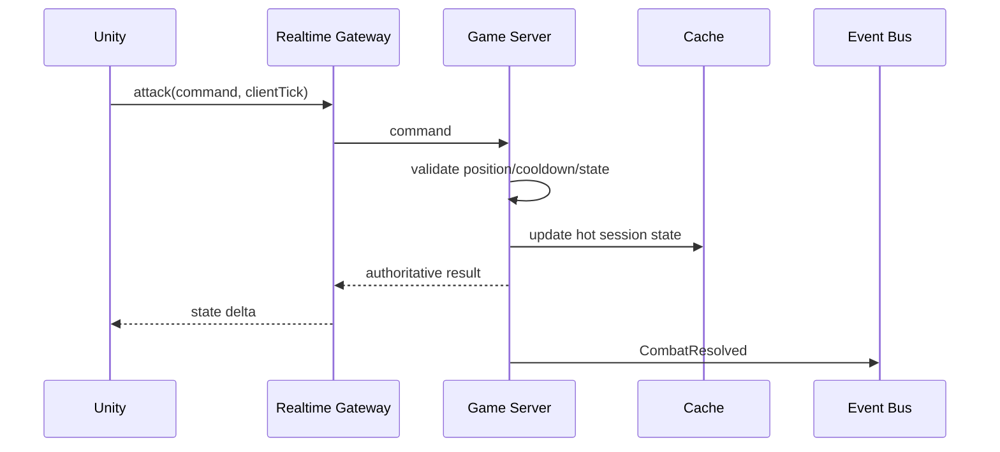
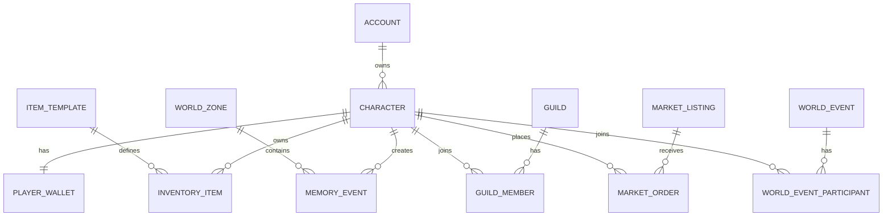
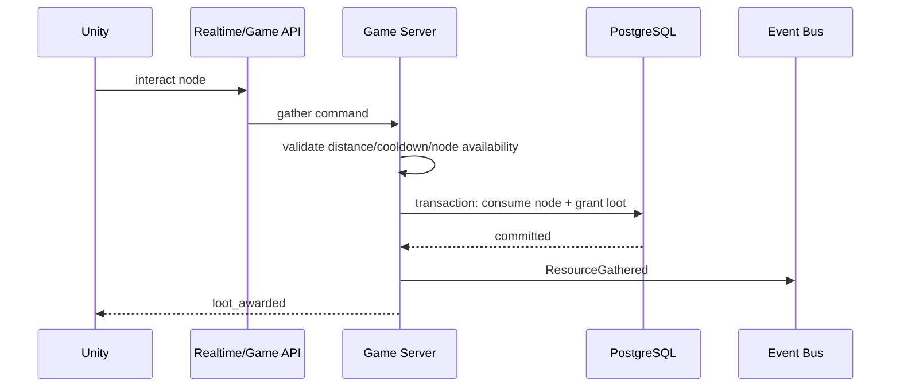
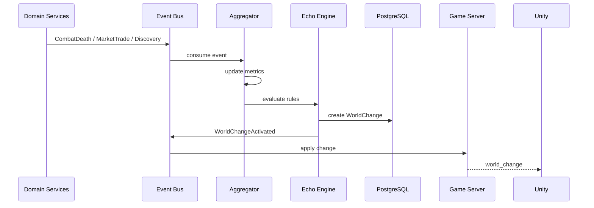
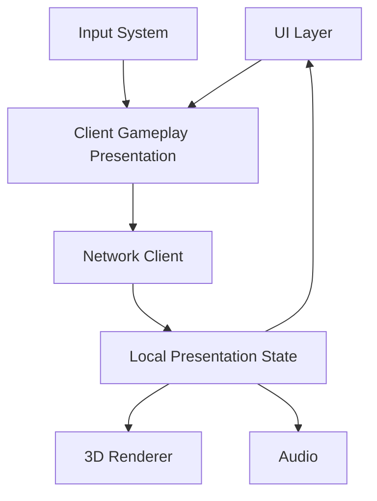

# ECHO — Complete Game Design & Technical Specification

> Combined specification generated from the product, architecture, database, API, workflow, mobile 3D, economy, security and roadmap documents.


---

# ECHO — Product Requirements Document (PRD)

## 1. Product summary

**Working title:** ECHO
**Platform:** iOS / Android
**Genre:** Online 3D RPG + social simulation + dynamic world
**Primary session:** 5–15 minutes
**Secondary session:** 30–60 minutes for dungeon, events and social play
**Target:** Players who enjoy progression, discovery, collection, economy and seeing persistent consequences in a shared world.

### One-line value proposition

> Explore a persistent 3D world whose future content is shaped by the collective history of its players.

## 2. Problem / opportunity

Most progression games have a static content loop: the developer creates the map, quest, boss and rewards; players consume them. ECHO adds a second loop: **player actions become signals that can influence future content**.

The product opportunity is to make the player feel that:
- what they did mattered;
- discoveries are socially valuable;
- the server has history;
- returning to the game can reveal consequences of previous behavior.

## 3. Product pillars

### P1 — Persistent memory
Important actions create Memory Events.

Examples:
- first player discovery;
- world boss defeat;
- unusual route used repeatedly;
- market shortage;
- large guild contribution;
- repeated player deaths in a zone.

### P2 — Reactive world
The server converts aggregated patterns into bounded world changes.

Examples:
- a new NPC appears;
- a forgotten shrine unlocks;
- a resource becomes scarce;
- a hidden event becomes available;
- an enemy variant is introduced.

### P3 — Progression
Character level, gear, collection, crafting and reputation provide familiar progression.

### P4 — Economy
Players gather, craft, consume and trade. The economy is designed around transparent sources and sinks.

### P5 — Social history
Guilds, shared discoveries and server-wide milestones create collective stories.

## 4. Personas

### Persona A — Progression Player
Wants clear goals, upgrades and efficient farming.

### Persona B — Explorer
Wants mysteries, secrets, rare discoveries and unusual interactions.

### Persona C — Trader/Crafter
Wants market activity, crafting depth and resource arbitrage.

### Persona D — Social Player
Wants guild identity, cooperative events and shared achievements.

## 5. Core loop

```text
Explore → Gather/Fight → Loot → Upgrade/Craft → Discover/Trade
                         ↓
                   Memory Event
                         ↓
              Echo aggregation/anomaly
                         ↓
                World reaction/event
                         ↓
                   Explore again
```

## 6. Game systems

### 6.1 Character
- Level and XP
- Base attributes
- Equipment
- Skills
- Cosmetic appearance
- Titles / achievements

### 6.2 World
- Hub city
- 3–5 PvE zones for MVP
- Dungeon instances
- World event area
- Resource nodes
- NPCs

### 6.3 Gear
- Common → Uncommon → Rare → Epic → Legendary
- Affixes
- Upgrade level
- Equipment score

### 6.4 Gathering / crafting
MVP professions:
- Foraging
- Mining
- Blacksmithing
- Alchemy

### 6.5 Memory
Memory Event categories:
- DISCOVERY
- COMBAT
- ECONOMY
- SOCIAL
- EXPLORATION
- FAILURE
- COLLECTION

Memory has two layers:
- **Personal Memory:** tied to a player.
- **World Memory:** aggregated across many players.

### 6.6 Echo Engine
The Echo Engine does not directly modify arbitrary database fields. It creates a proposed **World Change** with:
- trigger rule;
- evidence window;
- threshold;
- impact scope;
- start/end time;
- audit trail.

Examples:

```text
IF deaths(zone_04, 24h) >= 500
THEN create event "Whispering Fog"
```

```text
IF first_discovery(item_X) exists
THEN create world announcement + lore entry
```

```text
IF herb_supply / herb_demand < 0.20 for 6h
THEN activate "Herbalist Caravan"
```

## 7. Monetization product principles

Initial model:
- cosmetic items;
- season pass;
- convenience subscriptions;
- inventory/character slots;
- selected time-saving boosts.

Avoid designing mandatory spending gates for core progression in MVP.

## 8. User stories

### Epic: Onboarding
**US-001** As a new player, I want a short tutorial so I can understand movement, combat and inventory.

**Acceptance criteria**
- Tutorial completes in ≤15 minutes for a first-time player.
- Player completes movement, attack, loot and equip flows.
- Server persists tutorial completion.

### Epic: Exploration
**US-010** As an explorer, I want to discover hidden locations so that I can create rare memories.

**Acceptance criteria**
- At least 5 hidden points exist in MVP zones.
- First discovery is persisted server-side.
- Discovery can trigger a world announcement or lore update according to configured rules.

### Epic: Economy
**US-020** As a trader, I want to list items on the marketplace so other players can buy them.

**Acceptance criteria**
- Listing validates item ownership.
- Seller cannot spend/list the same item twice.
- Purchase is atomic: item ownership and currency movement either both succeed or both fail.
- Transaction fee is applied.

### Epic: Memory
**US-030** As a player, I want important things I did to be remembered so my character develops a history.

**Acceptance criteria**
- Significant actions create Memory Events.
- Memory events are deduplicated where required.
- Personal memory page displays the event timeline.

### Epic: World reaction
**US-040** As a player, I want the world to react to collective behavior so the server feels alive.

**Acceptance criteria**
- Echo rules are configurable by operations staff.
- A world change stores trigger evidence.
- Changes are reversible/expirable.
- Every change is auditable.

## 9. MVP scope

### In scope
- Account/login
- Character creation
- Hub city
- 3 PvE zones
- 1 dungeon
- 1 world boss
- 4 gathering/crafting systems
- Gear progression
- Inventory
- Marketplace
- Personal Memory timeline
- 10–20 Echo rules
- 5 reactive world events
- Basic guilds
- Daily quests
- Cosmetic store
- Season pass skeleton

### Out of scope
- PvP ranking
- Player housing customization beyond cosmetic starter version
- Cross-region server migration
- Fully procedural maps
- Player-generated scripts/code
- Fully autonomous AI NPCs

## 10. Product KPIs

These are operational targets for validation, not guaranteed outcomes:

| Metric | MVP measurement |
|---|---|
| Tutorial completion | % of new accounts finishing onboarding |
| D1/D7 retention | measured by cohort |
| Avg session length | minutes/session |
| Sessions/player/day | average |
| Marketplace participation | % active users listing or buying |
| Memory creation rate | memory events / DAU |
| World reaction discovery | % players encountering a reactive event |
| Crash-free sessions | client stability |
| API p95 latency | endpoint group |
| Economy inflation | gold creation vs destruction |

## 11. Product risks

| Risk | Impact | Mitigation |
|---|---|---|
| World reactions feel random | High | Show cause/effect messaging and evidence |
| Economy inflation | High | tune sinks and server-side caps |
| Cheating | High | authoritative server and anomaly detection |
| Content production cost | Medium | bounded event templates |
| Mobile performance | High | stylized assets, LOD, batching, budgets |
| New players feel behind | High | catch-up systems and rotating zones |

## 12. Definition of Done for gameplay feature

A feature is done when:
- product behavior is documented;
- server validation exists;
- happy-path and failure tests exist;
- telemetry exists;
- client UI/UX is implemented;
- exploit paths are reviewed;
- rollback/admin operation is available when the feature affects economy or world state.


---

# ECHO — System Architecture

## 1. Architecture goals

- Server authoritative gameplay
- Horizontal scaling for API and realtime sessions
- Strong consistency for inventory/currency transactions
- Event-driven world evolution
- Mobile-friendly network protocol
- Operational simplicity for MVP

## 2. Technology recommendation

| Layer | Technology | Responsibility |
|---|---|---|
| Mobile client | Unity + C# | 3D rendering, input, local presentation |
| API/BFF | Go or Java | authenticated HTTP APIs, orchestration |
| Realtime | WebSocket gateway + game instance servers | movement/combat/event delivery |
| Game simulation | Go | authoritative session simulation |
| Primary DB | PostgreSQL | accounts, characters, inventory, economy, marketplace |
| Cache | Redis | sessions, presence, hot state, rate limits |
| Event bus | Kafka-compatible bus | durable domain/integration events |
| Analytics | ClickHouse/BigQuery-class store | BI, telemetry, economy analytics |
| Object storage | S3-compatible | replays, large assets, audit exports |
| Observability | OpenTelemetry + metrics/logging backend | traces, metrics, logs |
| CI/CD | GitHub Actions/GitLab CI | build, test, deploy |
| Container runtime | Kubernetes or managed container platform | service scheduling |

**MVP simplification:** API, Economy, Player and Memory can start as one modular backend application. Split services when scale or ownership requires it.

## 3. Logical architecture



## 4. Data ownership

| Domain | Owner |
|---|---|
| Account | Auth |
| Character/profile | Player |
| Inventory/equipment | Player + Economy transaction boundary |
| Currency ledger | Economy |
| Marketplace | Economy |
| World configuration | Game |
| Personal memory | Memory |
| World memory / Echo rules | Memory |
| Guild | Social |
| Telemetry | Analytics |

## 5. Request flow — normal REST action



## 6. Request flow — realtime combat



## 7. Echo Engine architecture

Echo Engine is a rules pipeline:

```text
Domain Events
   ↓
Aggregation Window
   ↓
Feature Metrics
   ↓
Rule Evaluation
   ↓
Candidate World Change
   ↓
Safety/Eligibility Checks
   ↓
Publish World Change
   ↓
Game Server consumes change
   ↓
Client receives event
```

### Rule object

```json
{
  "ruleCode": "ZONE_DEATH_FOG_01",
  "eventType": "COMBAT_DEATH",
  "windowMinutes": 1440,
  "threshold": 500,
  "scope": "ZONE",
  "action": "ACTIVATE_WORLD_EVENT",
  "cooldownMinutes": 10080,
  "durationMinutes": 180
}
```

## 8. Deployment topology

### MVP
- 1 API deployment
- 1 realtime gateway deployment
- 2+ game instance replicas
- 1 PostgreSQL primary + managed backups
- Redis
- Event bus
- object storage

### Scale-out
- partition game instances by region/zone
- autoscale API on CPU/RPS
- autoscale game servers on active sessions
- separate read replicas for reporting
- archive old analytics events

## 9. Non-functional requirements

| Area | Target for MVP |
|---|---|
| API availability | ≥99.9% monthly target |
| API p95 | <300 ms for non-heavy commands under expected load |
| Realtime tick | configurable; start around 10–20 Hz depending device/network |
| Durable economy writes | 100% transactional |
| Duplicate command protection | idempotency key where money/item state changes |
| Crash recovery | reconnect and resync authoritative state |
| Data backup | automated managed backups |
| Observability | request IDs + player/session IDs + trace IDs |

## 10. Architecture decisions

### ADR-001 — Server authoritative
Client never decides currency, loot, damage, inventory ownership or marketplace settlement.

### ADR-002 — PostgreSQL as transactional source of truth
Use relational transactions for currency/item ownership. Do not use Redis as the permanent source of truth.

### ADR-003 — Event-driven Echo
Memory/world evolution consumes immutable-ish domain events rather than scanning core tables on every request.

### ADR-004 — Light CQRS
Separate write commands from read models where needed. Do not introduce full event sourcing for every domain in MVP.


---

# ECHO — Database Design

## 1. Storage strategy

### PostgreSQL
Authoritative transactional data.

### Redis
Ephemeral/hot data:
- session presence;
- current game instance mapping;
- rate limit counters;
- short-lived locks;
- frequently accessed configuration cache.

### Event bus / event store
Domain events used for Echo aggregation and analytics pipelines.

### Analytics store
High-volume telemetry and BI queries.

## 2. ER model



## 3. Core tables

### account
```sql
id UUID PK
external_auth_id VARCHAR UNIQUE
status VARCHAR
created_at TIMESTAMPTZ
updated_at TIMESTAMPTZ
last_login_at TIMESTAMPTZ
```

### character
```sql
id UUID PK
account_id UUID FK account(id)
name VARCHAR UNIQUE
level INT
xp BIGINT
zone_id UUID NULL
created_at TIMESTAMPTZ
updated_at TIMESTAMPTZ
```

### player_wallet
```sql
character_id UUID PK FK character(id)
gold BIGINT NOT NULL
premium_coin BIGINT NOT NULL
version BIGINT NOT NULL
updated_at TIMESTAMPTZ
```

For production economy, also maintain a ledger.

### wallet_ledger
```sql
id UUID PK
character_id UUID FK character(id)
currency_type VARCHAR
amount BIGINT
balance_after BIGINT
reason_code VARCHAR
reference_type VARCHAR
reference_id UUID
idempotency_key VARCHAR UNIQUE
created_at TIMESTAMPTZ
```

### item_template
```sql
id UUID PK
code VARCHAR UNIQUE
name VARCHAR
rarity VARCHAR
item_type VARCHAR
bind_type VARCHAR
max_stack INT
metadata JSONB
```

### inventory_item
```sql
id UUID PK
character_id UUID FK character(id)
item_template_id UUID FK item_template(id)
quantity INT
upgrade_level INT
rolled_stats JSONB
status VARCHAR
version BIGINT
created_at TIMESTAMPTZ
updated_at TIMESTAMPTZ
```

### memory_event
```sql
id UUID PK
character_id UUID NULL FK character(id)
world_id UUID
zone_id UUID NULL
memory_type VARCHAR
source_event_id UUID
payload JSONB
importance SMALLINT
visibility VARCHAR
created_at TIMESTAMPTZ
```

### echo_rule
```sql
id UUID PK
rule_code VARCHAR UNIQUE
status VARCHAR
window_minutes INT
condition JSONB
action JSONB
cooldown_minutes INT
created_at TIMESTAMPTZ
updated_at TIMESTAMPTZ
```

### world_change
```sql
id UUID PK
world_id UUID
rule_id UUID FK echo_rule(id)
change_type VARCHAR
payload JSONB
status VARCHAR
starts_at TIMESTAMPTZ
ends_at TIMESTAMPTZ NULL
trigger_metric JSONB
audit JSONB
created_at TIMESTAMPTZ
```

### market_listing
```sql
id UUID PK
seller_character_id UUID FK character(id)
inventory_item_id UUID FK inventory_item(id)
quantity INT
unit_price BIGINT
currency_type VARCHAR
status VARCHAR
expires_at TIMESTAMPTZ
created_at TIMESTAMPTZ
```

### market_order
```sql
id UUID PK
listing_id UUID FK market_listing(id)
buyer_character_id UUID FK character(id)
quantity INT
gross_amount BIGINT
fee_amount BIGINT
net_amount BIGINT
status VARCHAR
created_at TIMESTAMPTZ
```

### world_event
```sql
id UUID PK
world_id UUID
code VARCHAR
name VARCHAR
status VARCHAR
config JSONB
starts_at TIMESTAMPTZ
ends_at TIMESTAMPTZ
created_by VARCHAR
```

## 4. Important indexes

```sql
CREATE INDEX idx_character_account ON character(account_id);
CREATE INDEX idx_inventory_character ON inventory_item(character_id);
CREATE INDEX idx_memory_world_created ON memory_event(world_id, created_at DESC);
CREATE INDEX idx_memory_character_created ON memory_event(character_id, created_at DESC);
CREATE INDEX idx_market_status_expiry ON market_listing(status, expires_at);
CREATE INDEX idx_market_template ON market_listing(item_template_id, status, unit_price);
CREATE UNIQUE INDEX uq_wallet_ledger_idempotency ON wallet_ledger(idempotency_key);
```

## 5. Transaction rules

### Buy item
Single database transaction:
1. Lock/validate listing.
2. Lock buyer wallet row.
3. Verify balance.
4. Lock/validate inventory ownership.
5. Move item ownership/quantity.
6. Create debit ledger.
7. Create seller credit ledger.
8. Mark listing/order status.
9. Commit.
10. Publish `MarketplaceOrderCompleted` after commit.

### Upgrade item
Single transaction for:
- item version check;
- material deduction;
- currency deduction;
- upgrade state update;
- ledger entries.

## 6. Memory retention

Recommended MVP policy:
- Keep all high-importance personal memories.
- Keep lower-value raw memories for a rolling period.
- Aggregate older raw events into daily/weekly metrics.
- Keep world-level memories long term.

## 7. Sharding / partitioning path

Do not shard MVP.

When needed:
- partition event-heavy tables by month/world;
- route world/game data by `world_id`;
- isolate analytics storage from transactional DB.


---

# ECHO — API Specification

## 1. API conventions

Base path: `/v1`

Auth: Bearer access token.

Headers for state-changing requests:
- `Authorization: Bearer <token>`
- `X-Request-Id: <uuid>`
- `Idempotency-Key: <uuid>` when applicable

Content-Type: `application/json`

## 2. Standard response

### Success
```json
{
  "requestId": "7e5d...",
  "data": {}
}
```

### Error
```json
{
  "requestId": "7e5d...",
  "error": {
    "code": "INSUFFICIENT_GOLD",
    "message": "Not enough gold",
    "details": {}
  }
}
```

## 3. Auth APIs

| Method | Endpoint | Purpose |
|---|---|---|
| POST | `/auth/guest` | Guest account bootstrap |
| POST | `/auth/refresh` | Refresh token |
| POST | `/auth/link` | Link social/store identity |

## 4. Player APIs

| Method | Endpoint | Purpose |
|---|---|---|
| GET | `/me` | Account summary |
| GET | `/characters` | List characters |
| POST | `/characters` | Create character |
| GET | `/characters/{id}` | Character detail |
| PATCH | `/characters/{id}` | Rename/cosmetic-safe profile updates |
| GET | `/characters/{id}/inventory` | Inventory |
| GET | `/characters/{id}/equipment` | Equipped items |
| POST | `/characters/{id}/equip` | Equip item |
| POST | `/characters/{id}/unequip` | Unequip item |

## 5. Game APIs

| Method | Endpoint | Purpose |
|---|---|---|
| GET | `/world` | World bootstrap |
| GET | `/zones` | Available zones |
| GET | `/zones/{id}` | Zone detail |
| POST | `/sessions/join` | Request game session |
| POST | `/sessions/leave` | Leave session |
| POST | `/quests/{id}/accept` | Accept quest |
| POST | `/quests/{id}/claim` | Claim completed reward |
| POST | `/gather` | Gather resource node |
| POST | `/craft` | Craft recipe |
| POST | `/dungeons/{id}/enter` | Enter dungeon |
| POST | `/world-events/{id}/join` | Join world event |

## 6. Memory APIs

| Method | Endpoint | Purpose |
|---|---|---|
| GET | `/characters/{id}/memories` | Personal timeline |
| GET | `/worlds/{id}/memories` | Public world memories |
| GET | `/worlds/{id}/changes` | Active/history of world changes |
| GET | `/discoveries` | Discovery catalog |

## 7. Economy APIs

| Method | Endpoint | Purpose |
|---|---|---|
| GET | `/wallet` | Current balances |
| GET | `/wallet/ledger` | Ledger history |
| GET | `/market/listings` | Search marketplace |
| POST | `/market/listings` | Create listing |
| DELETE | `/market/listings/{id}` | Cancel listing |
| POST | `/market/orders` | Buy item |
| GET | `/market/orders/{id}` | Order detail |

### Create listing
```http
POST /v1/market/listings
Authorization: Bearer <token>
Idempotency-Key: 6df...
```
```json
{
  "inventoryItemId": "item-uuid",
  "quantity": 2,
  "unitPrice": 1500,
  "currencyType": "GOLD"
}
```

### Buy listing
```http
POST /v1/market/orders
```
```json
{
  "listingId": "listing-uuid",
  "quantity": 2
}
```

## 8. Guild APIs

| Method | Endpoint | Purpose |
|---|---|---|
| POST | `/guilds` | Create guild |
| GET | `/guilds/{id}` | Guild detail |
| POST | `/guilds/{id}/join` | Join |
| POST | `/guilds/{id}/leave` | Leave |
| POST | `/guilds/{id}/contribute` | Contribute resources |
| GET | `/guilds/{id}/discoveries` | Guild discoveries |

## 9. Shop APIs

| Method | Endpoint | Purpose |
|---|---|---|
| GET | `/shop/catalog` | Premium catalog |
| POST | `/shop/purchase` | Purchase non-random entitlement |
| GET | `/entitlements` | Owned premium entitlements |

## 10. WebSocket

Endpoint: `/ws/game`

### Client → Server commands

```json
{"type":"move","seq":103,"x":10.1,"z":3.2}
{"type":"attack","seq":104,"skillId":"slash_01","targetId":"mob-12"}
{"type":"interact","seq":105,"objectId":"node-77"}
```

### Server → Client events

```json
{"type":"state_delta","tick":8842,"entities":[...]}
{"type":"combat_result","tick":8843,"events":[...]}
{"type":"loot_awarded","items":[...]}
{"type":"world_change","changeCode":"WHISPERING_FOG"}
{"type":"resync_required","reason":"server_restarted"}
```

## 11. API error codes

| Code | Meaning |
|---|---|
| AUTH_REQUIRED | invalid/expired token |
| FORBIDDEN | authenticated but not allowed |
| VALIDATION_ERROR | bad request |
| VERSION_CONFLICT | stale client/item version |
| INSUFFICIENT_GOLD | not enough gold |
| ITEM_NOT_OWNED | ownership check failed |
| LISTING_UNAVAILABLE | listing already sold/expired |
| COOLDOWN_ACTIVE | action not ready |
| RATE_LIMITED | request throttled |
| WORLD_CHANGE_INVALID | world state no longer valid |

## 12. Workflow: gather resource



## 13. Workflow: Echo world reaction



## 14. Idempotency rules

Use idempotency for:
- purchases;
- marketplace order creation;
- reward claims;
- premium grants;
- any request mutating currency/item ownership.

The same `Idempotency-Key` must return the original result for the same authenticated actor.


---

# ECHO — Game Workflow by Stage

## Stage 0 — Login / bootstrap

```text
Open app
→ authenticate
→ load profile
→ choose character
→ download only required content
→ connect realtime
→ receive world snapshot
```

**Failure:** network unavailable → cached shell + retry; no authoritative state mutation locally.

## Stage 1 — Tutorial

Goal: teach the 4 essential actions.

1. Move
2. Attack
3. Loot
4. Equip

Tutorial also demonstrates the first Memory Event.

### Example
Player enters a hidden cave.

Server creates:
`DISCOVERY:CAVE_001`

UI:
> “The world will remember this discovery.”

## Stage 2 — Daily loop

```text
Login
 ↓
Daily missions
 ↓
Choose activity
 ├─ Explore
 ├─ Gather
 ├─ Dungeon
 ├─ Craft
 └─ Trade
 ↓
Reward
 ↓
Upgrade
 ↓
Check Memory / Echo feed
```

## Stage 3 — Exploration workflow

```text
Enter zone
→ inspect interactables
→ move to POI
→ solve small mechanic / combat gate
→ collect item
→ server validates
→ Memory Event created
→ discovery flag stored
```

## Stage 4 — Combat workflow

### Pre-combat
- server assigns entity IDs;
- client receives snapshot;
- skill cooldown state synchronized.

### During combat
- client sends intent;
- server validates range/cooldown/resource;
- server calculates damage/status/loot eligibility;
- state delta returned.

### Post-combat
- loot transaction committed;
- combat event published;
- significant outcomes may create Memory Event.

## Stage 5 — Crafting workflow

```text
Open recipe
→ validate recipe
→ validate materials
→ reserve/consume materials
→ roll quality/stats on server
→ create item
→ audit event
```

No client-side stat roll.

## Stage 6 — Marketplace workflow

```text
Seller selects item
→ server validates ownership
→ item locked for listing
→ listing created
→ buyer searches
→ buyer confirms
→ DB transaction moves currency + item
→ fee removed
→ events published
```

## Stage 7 — Personal Memory

Memory categories shown as timeline cards:
- First Discovery
- Greatest Victory
- Rare Find
- Near Death
- Guild Milestone
- Market Deal

Each card can include:
- timestamp;
- zone;
- short title;
- rarity/importance;
- associated item or event.

## Stage 8 — Collective Memory

Every action is not automatically public. The Memory Service selects events by configured importance.

```text
Raw domain event
→ significance filter
→ privacy/visibility check
→ aggregate
→ world memory
```

## Stage 9 — Echo reaction

### Example: “Whispering Fog”

Condition:
- ≥500 player deaths in zone within 24h.

Reaction:
- zone visual changes;
- new enemy variant;
- rare material chance increases;
- NPC dialog changes;
- event timer starts.

Event expiry:
- 3 hours.

### Player-facing sequence

```text
Death statistics threshold reached
        ↓
Server activates event
        ↓
Push announcement
        ↓
Map gets new visual state
        ↓
New enemy/event appears
        ↓
Players investigate
        ↓
Memories created
```

## Stage 10 — World discovery chain

An Echo reaction may have phases:

### Phase A — Signal
Anomaly begins.

### Phase B — Investigation
Players discover clues.

### Phase C — Community milestone
Required number of clues collected.

### Phase D — Resolution
Boss/NPC/area becomes available.

### Phase E — Permanent memory
World records the event in history.

## Stage 11 — Season flow

```text
Season announcement
→ preload assets
→ launch theme
→ new Echo rules
→ weekly world changes
→ season quests
→ season shop
→ final event
→ archive season memories
```

## Stage 12 — Offline / reconnect

When disconnected:
- allow only non-authoritative UI navigation;
- queue no gameplay result as final truth;
- on reconnect request state version;
- server sends delta or full resync.

## Stage 13 — Admin / GM workflow

```text
Monitor metric
→ identify abnormal state
→ inspect evidence
→ enable/disable Echo rule
→ force/expire World Change if needed
→ audit reason
```

No direct editing of balances/items outside controlled tools with audit logs.

## 14. State machines

### Character session

`OFFLINE → CONNECTING → CONNECTED → IN_GAME → RECONNECTING → CONNECTED/LOGOUT`

### Marketplace listing

`DRAFT → ACTIVE → LOCKED → SOLD/EXPIRED/CANCELLED`

### World change

`PROPOSED → VALIDATED → ACTIVE → EXPIRED/REVERTED`

### Echo rule

`DRAFT → ACTIVE → PAUSED → RETIRED`


---

# ECHO — Mobile 3D Game Design

## 1. Visual direction

### Target style
Stylized 3D fantasy/sci-fi with a clean, readable silhouette rather than photorealism.

Why:
- lower device cost;
- recognizable characters;
- easier content production;
- strong cosmetic opportunities;
- readable combat on small screens.

## 2. Camera

Primary camera:
- 3/4 isometric perspective;
- slight follow lag;
- dynamic zoom within bounded range;
- combat focus on current target;
- no forced camera shake except short, optional effects.

Approximate starting values:
- pitch: 45–55°;
- distance: 8–14 units depending area;
- FOV: tune per device and composition.

## 3. Controls

### Left thumb
Virtual joystick for movement.

### Right thumb
Contextual action cluster:
- basic attack;
- 3–4 skills;
- dodge;
- interact.

### Contextual interaction
When near a resource/NPC:
- one large interaction affordance;
- hide irrelevant actions.

## 4. Core HUD

```text
┌────────────────────────────────────┐
│ HP        LV │ Quest / Echo Alert  │
│ XP BAR                            │
│                                    │
│        3D WORLD / CHARACTER        │
│                                    │
│   Joystick                 Skills  │
│   ◉                     ○ ○ ○ ○    │
│                         Attack      │
│                         ◎           │
└────────────────────────────────────┘
```

## 5. Main menu architecture

Bottom navigation:
- **World**
- **Character**
- **Memory**
- **Market**
- **Guild**

Top-level actions should remain within one or two taps from the hub.

## 6. Memory UI

Memory should feel like a living scrapbook.

Card anatomy:
```text
[ICON] First Discovery
Cave of Echoes
18 Sep • Zone 02
“First player in your account to...”
[View location]
```

World memory feed:
- recent;
- rare;
- community milestones;
- active Echoes.

## 7. Echo event presentation

The player should recognize a world reaction in three layers.

### Layer 1 — Subtle
Environmental change.

### Layer 2 — UI signal
Map icon / banner.

### Layer 3 — Narrative
NPC dialog / lore card.

Avoid overwhelming the player with giant notifications for every event.

## 8. 3D world structure

### Hub city
- low-combat area;
- market;
- crafting;
- guild;
- quest board;
- memory archive.

### PvE zone
Each zone contains:
- 1 visual theme;
- 2–3 enemy families;
- gathering nodes;
- 3–5 POIs;
- 1 hidden discovery;
- 1 Echo event slot.

### Dungeon
- instanced;
- 5–10 minute target;
- 3 encounter rooms;
- 1 boss;
- loot table.

## 9. World reaction visual language

Every world change has:
- palette modifier;
- ambient VFX;
- weather/fog preset;
- prop set;
- enemy variant;
- UI badge.

Examples:

**Whispering Fog**
- volumetric-looking fog approximation where affordable;
- desaturated environment;
- distant audio cue;
- spectral enemies.

**Merchant Caravan**
- wagon NPCs;
- temporary market stall props;
- route marker;
- trade bonus UI.

## 10. Mobile performance budget

Target baseline: mid-tier mobile device.

Starting budgets:
- target 30 FPS baseline;
- 60 FPS mode on capable devices;
- keep main scene draw calls conservative;
- aggressively use LOD;
- bake static lighting where possible;
- limit real-time shadows;
- pool combat VFX;
- cap visible AI actors in crowded zones;
- stream assets by area.

These are starting budgets and should be validated on the actual device matrix.

## 11. Rendering approach

Recommended:
- Unity URP;
- baked lighting for static areas;
- light probes for characters;
- LOD groups;
- occlusion culling for dense hubs;
- GPU instancing for repeated props;
- Addressables/content bundles for staged download.

Avoid for MVP:
- excessive transparent materials;
- high-poly unique assets for common props;
- heavy post-processing;
- large always-loaded maps.

## 12. Asset hierarchy

```text
Assets/
  Addressables/
    Characters/
    Enemies/
    Environment/
    VFX/
    Audio/
    UI/
  Scenes/
    Bootstrap
    Hub
    Zone_01
    Zone_02
    Zone_03
  ScriptableObjects/
    Items
    Skills
    Quests
    EchoRules
```

## 13. Unity runtime architecture



The client can predict visual movement for responsiveness, but authoritative outcomes come from the server.

## 14. UX principles

- One primary action per context.
- Avoid tiny tap targets.
- Critical actions need confirmation only when destructive.
- Combat UI must not overlap enemy telegraphs.
- Network failure must be visible but non-disruptive.
- Loading screens communicate what is being downloaded.

## 15. Accessibility

MVP support:
- adjustable UI scale;
- vibration toggle;
- color-independent rarity indicators;
- subtitle option;
- low-VFX mode;
- 30 FPS battery-saver mode.

## 16. Sample screen flow

```text
Login
 ↓
Character Select
 ↓
Hub
 ├→ World Map → Zone → Dungeon
 ├→ Character → Gear
 ├→ Memory → Personal / World
 ├→ Market
 └→ Guild
```


---

# ECHO — Economy & Monetization

## 1. Currencies

### Gold
Earned through gameplay.

Sources:
- quests;
- combat;
- selling items;
- events.

Sinks:
- upgrades;
- crafting fees;
- marketplace fees;
- repair/fast travel if used;
- NPC services.

### Premium Coin
Bought with real money.

Use:
- cosmetics;
- convenience;
- season pass;
- selected account slots.

## 2. Economy diagram

```text
               ┌───────────┐
               │  Monsters │
               └─────┬─────┘
                     ↓
                  Materials
                     ↓
┌──────────┐     Crafting     ┌──────────┐
│ Explorer │ ───────────────→ │ Crafter  │
└────┬─────┘                  └────┬─────┘
     ↓                              ↓
     └──────── Marketplace ←───────┘
                    ↓
                  Buyer
                    ↓
                 Currency
                    ↓
                  Sinks
```

## 3. Marketplace constraints

- tax/fee configurable;
- listing duration configurable;
- maximum listings per account;
- price bounds to reduce manipulation;
- transaction audit log;
- suspicious trading detection.

## 4. Monetization catalog

### Cosmetic
- outfits;
- weapon VFX;
- mount skins;
- emotes;
- titles.

### Convenience
- inventory expansion;
- additional character slot;
- extra expedition slot;
- limited daily auto-collection convenience.

### Subscription
- monthly convenience bundle;
- premium daily reward;
- cosmetic currency.

### Season pass
- free track;
- premium track;
- mostly cosmetic and convenience rewards in initial design.

## 5. Anti-pay-to-win guardrail

Create a policy that every purchasable item is classified as:
`COSMETIC`, `CONVENIENCE`, `PROGRESSION_ASSIST`, or `POWER`.

For MVP, direct `POWER` purchases should be disabled or tightly limited so that normal progression remains viable without payment.

## 6. Economy monitoring

Daily dashboards:
- gold minted;
- gold destroyed;
- premium currency minted/spent;
- item creation/destruction;
- marketplace turnover;
- median prices;
- top 1% holdings;
- suspicious transfer graph;
- sink/source ratio.

## 7. Manipulation controls

- account age requirements for high-value trading;
- trade limits for new accounts;
- abnormal price detection;
- self-trade detection;
- rapid transfer alerts;
- item/currency provenance.


---

# ECHO — Security, Anti-Cheat & Operations

## 1. Trust boundary

Untrusted:
- client coordinates;
- claimed damage;
- claimed loot;
- claimed inventory;
- claimed currency;
- client timestamps.

Trusted:
- server simulation;
- database transactions;
- signed configuration;
- server time.

## 2. Anti-cheat model

### Server validation
Validate:
- movement speed;
- attack cooldown;
- skill resource;
- target distance;
- loot ownership;
- node availability;
- quest state.

### Anomaly detection
Track:
- impossible movement;
- impossible action rate;
- repeated rare-drop patterns;
- abnormal marketplace transfers;
- unusual account graph behavior.

Do not auto-ban solely from one weak signal. Route high-risk cases to a review workflow or escalating controls.

## 3. Idempotency / replay protection

Every state-changing API has:
- request ID;
- actor ID;
- idempotency key when required;
- server timestamp;
- audit reason.

## 4. Payments

Payment flow:

```text
Mobile Store / Payment Provider
→ receipt/token
→ backend verification
→ entitlement transaction
→ ledger/audit
→ client refresh
```

Never trust a client-side “payment success” flag.

## 5. Observability

### Metrics
- API RPS
- p50/p95/p99 latency
- WebSocket active connections
- game tick lag
- reconnect rate
- DB connection usage
- Redis latency
- event-bus consumer lag
- economy source/sink rates

### Logs
Structured JSON with:
- timestamp;
- requestId;
- accountId/characterId where permitted;
- worldId;
- endpoint/command;
- result code.

## 6. Admin roles

| Role | Scope |
|---|---|
| Support | read player state, support actions |
| GM | world event controls |
| Economy Analyst | economy reports, no direct item edits |
| Developer | technical diagnostics |
| Super Admin | audited high-risk operations |

## 7. Operational controls

For economy/world changes:
- dry-run mode;
- preview impact;
- explicit confirmation;
- audit log;
- rollback/expiry where possible.

## 8. Disaster recovery

### Recovery priorities
1. Preserve currency/item integrity.
2. Restore authentication.
3. Restore world/session availability.
4. Rebuild analytics asynchronously.

### Backups
- managed DB backups;
- point-in-time recovery where available;
- periodic restore drills.


---

# ECHO — MVP Roadmap & Delivery Plan

## 1. Team shape

Lean team example:

- 1 PO/BA
- 1 PM/Producer
- 2 Backend engineers
- 2 Unity engineers
- 1 3D artist
- 1 UI/UX designer
- 1 QA
- part-time DevOps

A smaller team can combine PM/BA and use a single backend engineer initially, but scope must shrink accordingly.

## 2. Milestones

### M0 — Foundation
Deliver:
- project repositories;
- CI/CD;
- auth;
- logging/tracing;
- database migrations;
- Unity bootstrap;
- basic network layer.

Exit criteria:
- client can authenticate;
- API health and telemetry available;
- build deploys automatically to test environment.

### M1 — Core gameplay
Deliver:
- character;
- movement;
- combat;
- loot;
- inventory;
- 1 zone;
- tutorial.

Exit criteria:
- end-to-end 10-minute playable loop.

### M2 — Progression / economy
Deliver:
- crafting;
- upgrade;
- gold;
- marketplace;
- ledger;
- daily quest.

Exit criteria:
- buy/sell economy works transactionally;
- basic economy dashboard exists.

### M3 — Memory
Deliver:
- personal timeline;
- discovery system;
- world memory feed;
- event pipeline.

Exit criteria:
- significant actions become visible memories.

### M4 — Echo Engine
Deliver:
- rule engine;
- 5 world reactions;
- admin control;
- world change lifecycle.

Exit criteria:
- controlled test can trigger an event from aggregated behavior.

### M5 — Mobile polish
Deliver:
- performance pass;
- asset streaming;
- UI polish;
- crash analytics;
- reconnect/resync.

Exit criteria:
- target device matrix passes defined performance and stability gates.

### M6 — Closed beta
Deliver:
- guild basics;
- season framework;
- store;
- support tooling;
- anti-abuse controls.

Exit criteria:
- no open critical exploit in economy or progression;
- crash and latency thresholds within defined budget.

## 3. Priority backlog

### P0
- Authentication
- Character
- Movement
- Combat
- Inventory
- Loot
- Server authority
- PostgreSQL ledger
- Memory event

### P1
- Marketplace
- Crafting
- Echo Engine
- World events
- Guild
- Analytics

### P2
- Season pass
- Cosmetic store
- Advanced social features
- Housing
- more dynamic event chains

## 4. Sprint deliverable template

Each story must include:

```text
Goal
Actors
Preconditions
Main flow
Alternative flows
Validation rules
Data impact
API impact
Client impact
Telemetry
Acceptance criteria
Test cases
Rollback/admin impact
```

## 5. Release gates

### Functional gate
- P0 acceptance criteria pass.

### Economy gate
- no known duplicate-currency or duplicate-item path;
- ledger reconciliation passes.

### Performance gate
- target device frame-rate budget met;
- memory and load-time budget met.

### Network gate
- reconnect and resync verified;
- packet loss scenarios tested.

### Security gate
- common client tampering attempts rejected;
- payment entitlement verified server-side.

## 6. First playable vertical slice

The smallest version that proves the concept:

```text
Login
→ Hub
→ Zone
→ Fight 3 enemies
→ Discover hidden object
→ Receive Memory
→ Return Hub
→ View Memory
→ Trigger one Echo event from shared test activity
→ Re-enter zone and see world change
```

This vertical slice proves the unique product thesis before the team invests heavily in marketplace, guilds and long-form content.

